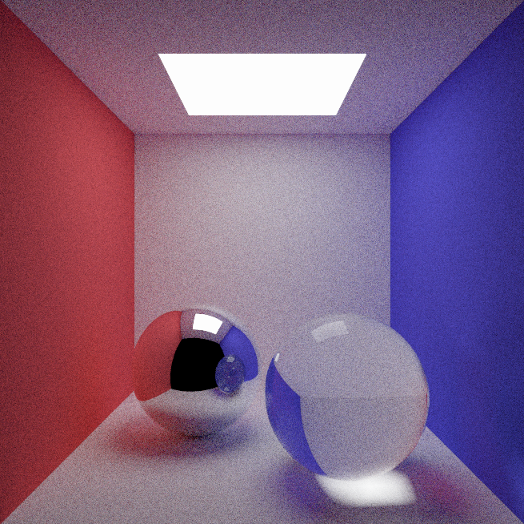
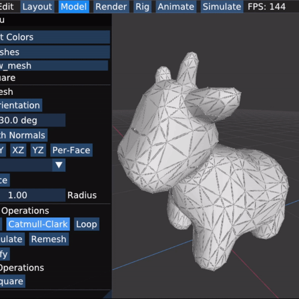
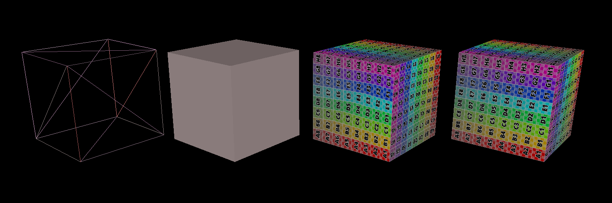

## Path Tracer & Meshedit

This project contains my implementation of core features of [Scotty3D](https://github.com/CMU-Graphics/Scotty3D), a 3D modeling, rendering, and animation package.

View the demo in the following subpage
- ### PathTracer
    
- ### MeshEditor
    
- ### Rasterizer
    
